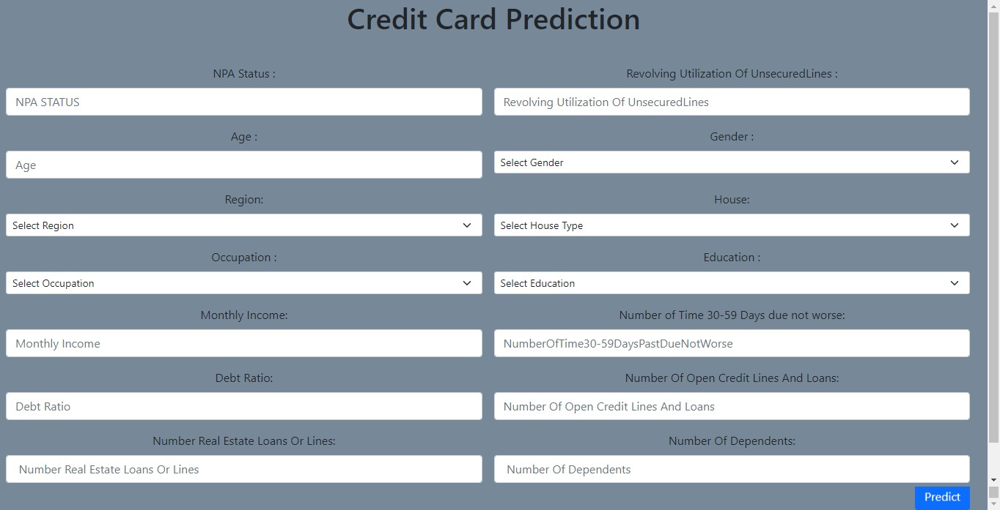
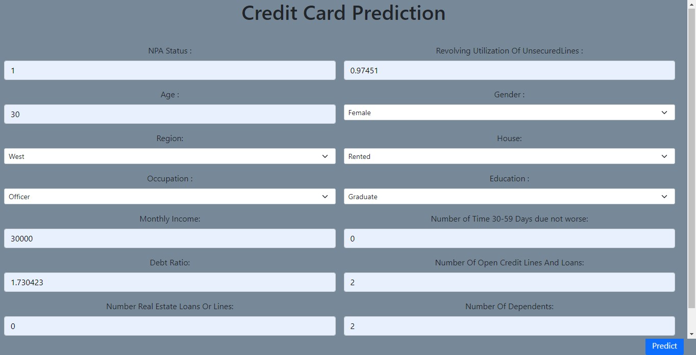
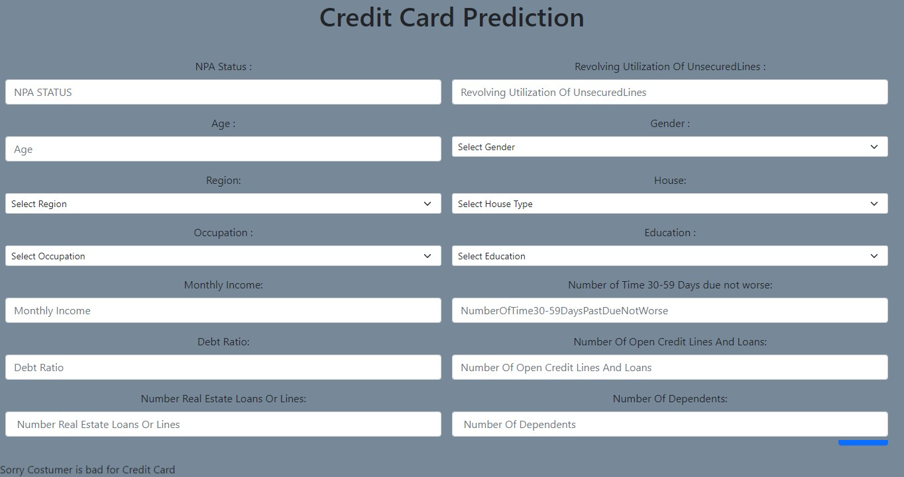

# Credit_Card_Classification
   This project predicts whether the customer is good or bad for credit card.

 1.Installation Process
  -   Clone project from github,
  -   Open project path on anaconda prompt,
  -   Run: python app.py
  -   Open localhost on your browser (ie: http://127.0.0.1:5000/)

results:

